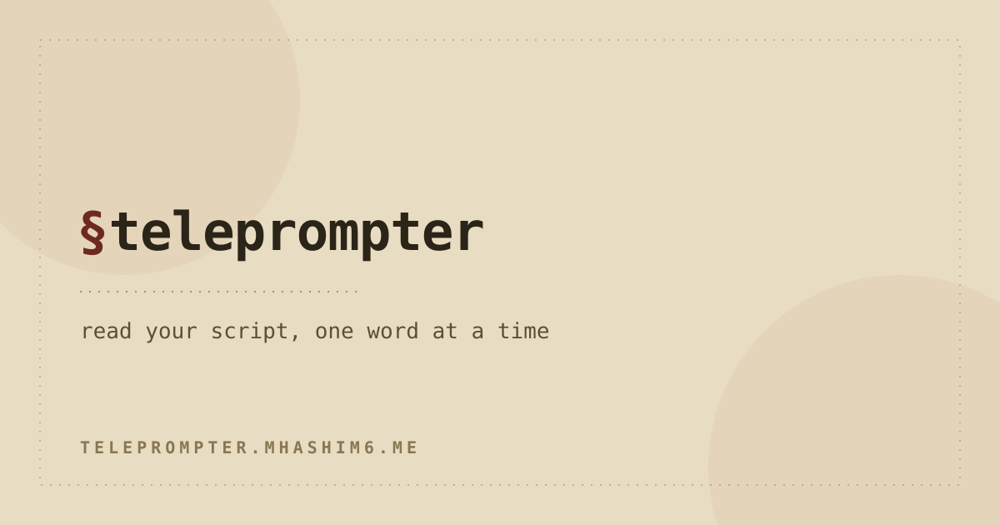

# teleprompter



A small, dependency-free teleprompter. It loads a JSON deck of slides, each with a spoken-word script, and plays the script back word by word at a pace you control. The current word is highlighted; text ahead stays readable; text already read fades back. Decks can carry pause beats. Day and night themes, adjustable pace and font size, mirror mode, and per-deck persistence so each deck remembers where you left off.

Plain HTML, CSS, and JavaScript. No build step, no framework, no bundler.

## Run

Two ways, both work:

- Open `index.html` directly in a browser (double-click, or a `file://` URL). The scripts are classic scripts and the images are referenced by relative path, so this works without a server.
- Or serve the folder and open the printed URL, for example: `python3 -m http.server` then visit `http://localhost:8000`.

## Test

The pure modules have Node test suites (dev-only; nothing ships, the app stays no-build). From the repo root:

```
node --test
```

This covers the schema normaliser, the timing engine, the playback shell (via an
injected scheduler), the storage layer (via a mock backend), the view-model, and the
deck-editor core (`studio.js`), and the landing-session data (`welcome.js`). The DOM
shells (`ui.js`, `studio-ui.js`) are verified by
hand — see the manual checklist in `HANDOFF.md`.

## Authoring a deck

Two ways:

- **In-app (Deck Studio).** Open the menu (bottom right) and choose **new deck**, or press the edit (pencil) icon on any deck in the library. The studio is a full-screen editor: add, duplicate, reorder, and delete slides; edit each slide's title, type, on-screen cue, and script (pause beats are written inline as `[[pause]]` or `[[pause:1.5]]`); and watch a live `words · ~m:ss` readout per slide and for the whole deck at the current pace. Optionally set a per-slide *target* minutes to compare against the real duration. Save keeps the deck on this device (editing updates it in place); **download** writes the `.json` file.
- **Script.** Edit the `slides` list in `tools/build_teleprompter.py` and run `python3 tools/build_teleprompter.py` from the repo root to regenerate `decks/teleprompter-slides-64-69.json`.

Pause beats go in the script text as `[[pause]]` (one second) or `[[pause:1.5]]` (custom). The full JSON contract is in `HANDOFF.md`, section 3.
